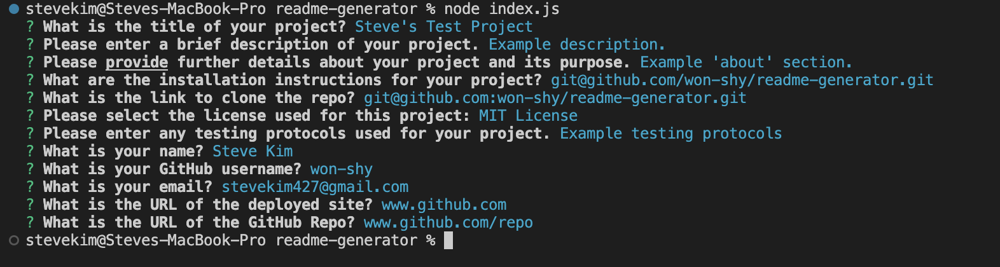
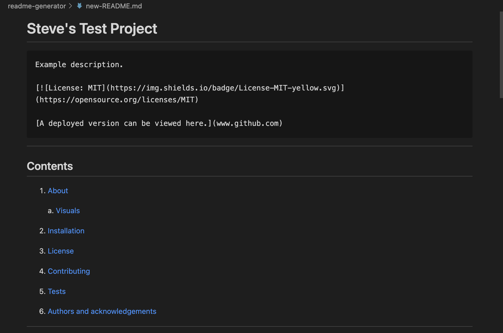
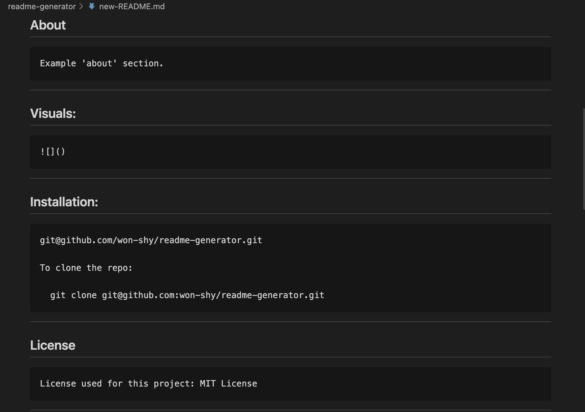

# readme-generator

## Description

The purpose of this project is to create a command-line application that dynamocally generates a professional README.md file from a user's input using the Inquirer package. This application will help to streamline the user's process of creating a professional and high-quality README for their application using Node.js.

## Installation

[Link to GitHub repo](https://github.com/won-shy/readme-generator)

To clone the repo:
git clone <git@github.com>:won-shy/readme-generator.git

## Usage

## Authors and Acknowledgements

Created by Steve Kim

## Credits

Collaborators include teachers, TAs, tutors and fellow students in the Columbia University Full Stack Engineering Bootcamp 2023 Spring cohort.

## Questions

For any questions or inquires please contact me via email at <stevekim427@gmail.com>
